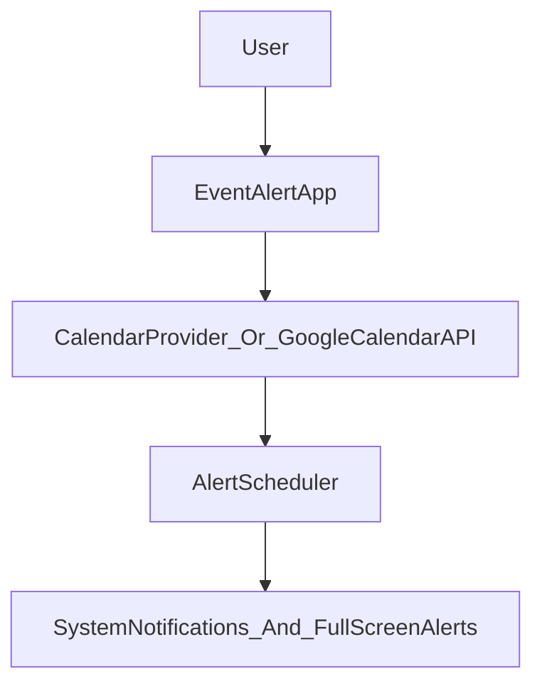

# Event Alert

Event Alert is a lightweight native Android app that creates high-signal alerts for your upcoming Google Calendar events. It acts as a thin layer between your existing calendars and the Android notification system to help you avoid missing important events that would otherwise be lost in a sea of standard push notifications.

The app focuses on a **single purpose**: surfacing full-screen, easy-to-act-on alerts for upcoming events, as close to native Android behavior as possible.

---

## Features

- **Calendar selection wizard**
  - On first launch, a simple wizard lets you pick which calendars to import from (e.g., specific Google accounts or calendars).

- **Event list**
  - Main screen shows an endless list of upcoming events pulled from the selected calendars.
  - Each item displays the event details and the scheduled alert time(s).

- **Smart alerts**
  - Full-screen style alerts for upcoming events, similar to native alarm-style alerts on some OEM devices.
  - Support for dismiss and snooze actions, using standard Android notification/alert behaviors where possible.

- **Configurable lead times**
  - Choose how far in advance alerts should trigger (e.g., 5, 10, 15+ minutes before an event).

- **Simple settings**
  - Change which calendars are imported from.
  - Enable/disable app-managed alerts.
  - Adjust sync interval / refresh behavior (e.g., how often to re-pull calendar data).

- **Non-goals**
  - Not a full calendar replacement UI.
  - No complex account management; relies on existing Google accounts on the device.
  - No server-side components; all logic runs on-device.

For more background on the product idea, mindset, and UI concept, see `docs/EventAlertMain.md`.

---

## Architecture & Data Flow (High-Level)

At a high level, Event Alert:

1. Reads calendar data from the device (Google Calendar / calendar provider).
2. Maps upcoming events into internal models.
3. Schedules future alerts using Android alarm/notification mechanisms.
4. Surfaces alerts as native-feeling, full-screen notifications with snooze/dismiss actions.

Conceptual flow:

The implementation will favor:

- Android calendar provider / Google Calendar APIs for event data.
- Alarm/notification APIs (and related Jetpack components) for scheduling.
- Jetpack Compose + Material 3 for the UI.

---

## Tech Stack

- **Language**: Kotlin
- **UI**: Jetpack Compose, Material 3
- **Android libraries**:
  - Android Jetpack (e.g., ViewModel, WorkManager or AlarmManager integration where appropriate)
  - AndroidX support libraries
- **Calendar access**:
  - Android Calendar Provider and/or Google Calendar API (depending on capabilities and permissions)
- **IDE**: Android Studio

Target platform: modern Android phones (phone-first experience; tablet behavior is a nice-to-have).

---

## Getting Started (Development)

### Prerequisites

- Android Studio installed (latest stable version recommended).
- Android SDK installed with a recent API level (exact minimum/target SDK to be defined as implementation starts).
- A device or emulator with:
  - At least one Google account configured.
  - Google Calendar or equivalent calendar data available.

### Setup

1. Open the project in Android Studio:
   - `File` → `Open...` → select the `EventAlert` project directory.
2. Let Gradle sync and resolve dependencies.
3. Select a run configuration and deploy to a device/emulator.

### Permissions

The app will require:

- **Calendar read access** to import events from the selected calendars.
- **Notification permission** to display alerts.
- **Exact alarm / schedule-related permissions** on newer Android versions, if required for precise alert timing.

The onboarding flow will explain why each permission is needed and request them at appropriate times.

---

## Usage Overview

### First Launch Wizard

- Walks the user through:
  - Granting calendar and notification permissions.
  - Choosing which calendars to import from.

### Main Screen

- Displays a scrolling list of upcoming events.
- Shows:
  - Event title, time, and calendar.
  - When an alert is planned to fire relative to the event start.

### Settings

- Configure:
  - Lead times (e.g., 5/10/15+ minutes before events).
  - Which calendars are included.
  - Whether Event Alert’s custom alerts are enabled.
  - Sync/refresh interval for calendar data.

---

## Roadmap (Planned Directions)

Planned and possible future enhancements:

- More flexible snooze options and presets.
- Per-event or per-calendar override rules for alerts.
- Additional polish for dark mode and Material 3 theming.
- Battery/performance tuning for background sync and scheduling.
- Potential companion experiences (e.g., Wear OS) if they align with the simple, single-purpose vision.

---

## Privacy & Data

- All calendar data is accessed **on-device** using Android’s APIs.
- No custom backend or external servers are planned; alerts are scheduled locally.
- Calendar information is used solely to:
  - Read upcoming events.
  - Schedule corresponding local alerts on the device.

If the privacy model changes (for example, if a backend is ever introduced), this section should be updated and clearly explained to users.

---

## License

License information is not yet defined for this project.  
Once chosen, the appropriate license text will be added here.

